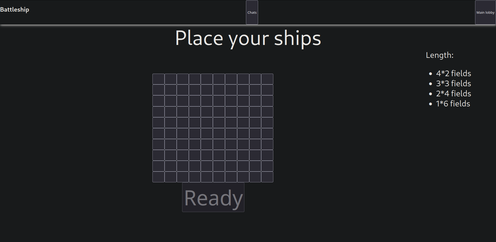
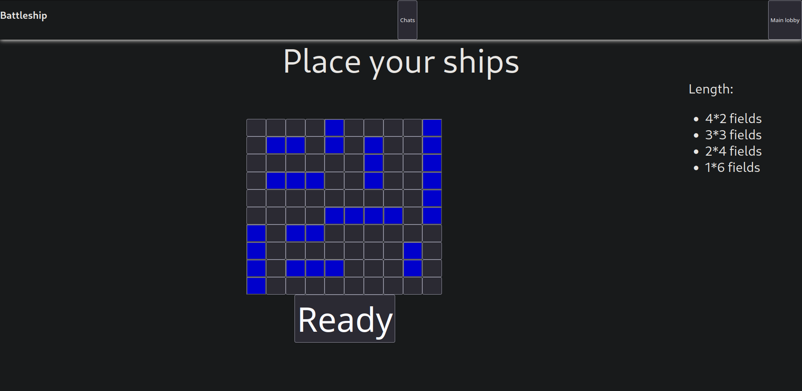
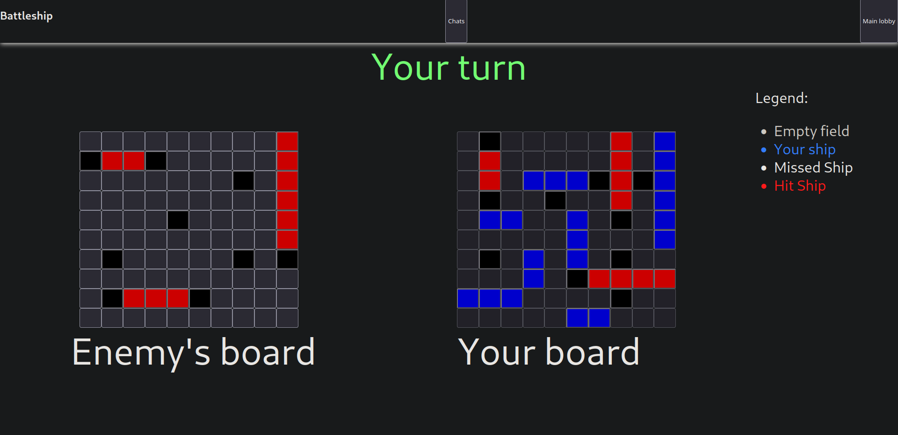
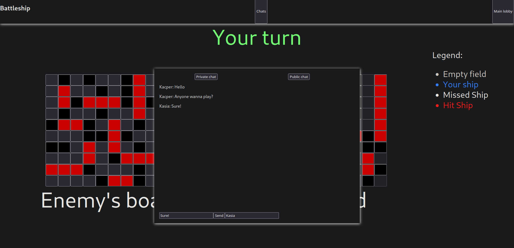
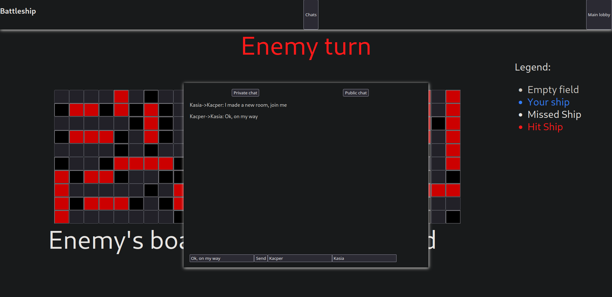

[![Contributors][contributors-shield]][contributors-url]
[![Forks][forks-shield]][forks-url]
[![Stargazers][stars-shield]][stars-url]
[![Issues][issues-shield]][issues-url]
[![MIT License][license-shield]][license-url]
[![LinkedIn][linkedin-shield]][linkedin-url]


<!-- PROJECT LOGO -->
<br />
<p align="center">
  <a href="https://github.com/KacperKurz/Battleship">
  </a>

  <h3 align="center">Battleship</h3>

  <p align="center">
    A simple battleship game made using http and mqtt protocols for my course.
    <br />
    <a href="https://github.com/KacperKurz/Battleship"><strong>Explore the docs »</strong></a>
    <br />
    <br />
    <a href="https://github.com/KacperKurz/Battleship/issues">Report Bug</a>
    ·
    <a href="https://github.com/KacperKurz/Battleship/issues">Request Feature</a>
  </p>


<!-- TABLE OF CONTENTS -->
<details open="open">
  <summary><h2 style="display: inline-block">Table of Contents</h2></summary>
  <ol>
    <li>
      <a href="#about-the-project">About The Project</a>
      <ul>
        <li><a href="#built-with">Built With</a></li>
      </ul>
    </li>
    <li>
      <a href="#getting-started">Getting Started</a>
      <ul>
        <li><a href="#prerequisites">Prerequisites</a></li>
        <li><a href="#installation">Installation</a></li>
      </ul>
    </li>
    <li><a href="#usage">Usage</a></li>
    <li><a href="#contact">Contact</a></li>
  </ol>
</details>


<!-- ABOUT THE PROJECT -->
## About The Project








### Built With

* [React](https://reactjs.org/)
* [Node](https://nodejs.org/en/)


<!-- GETTING STARTED -->
## Getting Started

To get a local copy up and running follow these simple steps.

### Prerequisites

* npm
  ```sh
  npm install npm@latest -g
  ```

### Installation

1. Clone the Battleship
   ```sh
   git clone https://github.com/KacperKurz/Battleship.git
   ```
2. Install NPM packages
   1. Change directory to "server" and run npm install
   ```shell
    cd server
    npm install
    ```
   2. Change directory to "mqtt" and run npm install
   ```shell
   cd ../mqtt
   npm install
   ```
   3. Change directory to "client" and run npm install
    ```shell
    cd ../client
    npm install
    ```
3. Start backend
    1. Change directory to "server" and start node
    ```shell
    cd ../server
    node index.js
   ```
   2. Change directory to "mqtt" and start node
   ```shell
   cd ../mqtt
   node index.js
   ```
4. Start frontend
```shell
cd ../client
npm start
```
   


<!-- USAGE EXAMPLES -->
## Usage

The app will start at http://localhost:3000. You can play with multiple people, although if you want to play on different devices you need to change the ip address in frontend.


<!-- CONTACT -->
## Contact

Kacper Kurz - kacperkurz@protonmail.com

Project Link: [https://github.com/KacperKurz/Battleship](https://github.com/KacperKurz/Battleship)


<!-- MARKDOWN LINKS & IMAGES -->
<!-- https://www.markdownguide.org/basic-syntax/#reference-style-links -->
[contributors-shield]: https://img.shields.io/github/contributors/KacperKurz/Battleship.svg?style=for-the-badge
[contributors-url]: https://github.com/KacperKurz/Battleship/graphs/contributors
[forks-shield]: https://img.shields.io/github/forks/KacperKurz/Battleship.svg?style=for-the-badge
[forks-url]: https://github.com/KacperKurz/Battleship/network/members
[stars-shield]: https://img.shields.io/github/stars/KacperKurz/Battleship.svg?style=for-the-badge
[stars-url]: https://github.com/KacperKurz/Battleship/stargazers
[issues-shield]: https://img.shields.io/github/issues/KacperKurz/Battleship.svg?style=for-the-badge
[issues-url]: https://github.com/KacperKurz/Battleship/issues
[license-shield]: https://img.shields.io/github/license/KacperKurz/Battleship.svg?style=for-the-badge
[license-url]: https://github.com/KacperKurz/Battleship/blob/master/LICENSE.txt
[linkedin-shield]: https://img.shields.io/badge/-LinkedIn-black.svg?style=for-the-badge&logo=linkedin&colorB=555
[linkedin-url]: https://linkedin.com/in/kacper-kurz-175707199/
